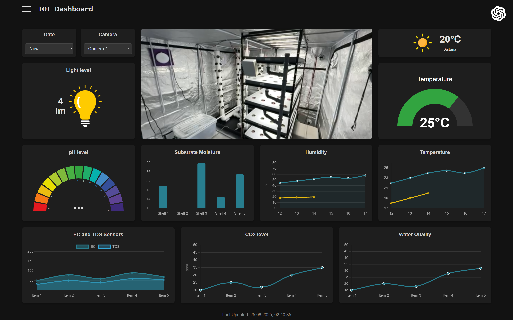

# Growbox Agrotech Monitoring System

A comprehensive system for monitoring and managing an automated growbox. It collects sensor data from an ESP device, provides a real-time dashboard, predicts future conditions with an ML model, and sends critical alerts.



## Key Features

*   **Real-time Monitoring**: Live data from growbox sensors (temperature, humidity, etc.) displayed on a web dashboard.
*   **Data Logging**: Sensor readings are saved to daily CSV files for historical analysis.
*   **Web Dashboard**: A Flask-powered interface to view current sensor data, watch a live camera feed, and interact with an AI chatbot. 
*   **ML Forecasting**: Predicts future growbox conditions using a machine learning model.
*   **Alerting System**: Sends notifications via Email and Telegram when sensor values exceed critical thresholds.
*   **Telegram Bot**: Fetch current sensor data, check server status, and receive alerts on the go.
*   **Admin Panel**: Allows staff to maintain a plant growth journal and view operational statistics.
*   **OTA Updates**: Remotely update the firmware on the ESP device. 
*   **Microservice Integration**: Communicates with a Go backend for extended functionality.


## Installation and Setup

### Prerequisites

*   Python 3.8+
*   Go 1.18+ (for the `MicroTrack` microservice)
*   A running SMTP server for email alerts
*   A Telegram Bot token

### Local Installation

1.  **Clone the repository:**
    ```bash
    git clone https://github.com/Kreichik/Growbox_agrotech.git
    cd Growbox_agrotech
    ```

2.  **Create a virtual environment and install Python dependencies:**
    ```bash
    python -m venv venv
    source venv/bin/activate  # On Windows, use `venv\Scripts\activate`
    pip install -r requirements.txt
    ```
    
3.  **Configure environment variables:**
    Create a `.env` file in the root directory and populate it with the necessary credentials.
    <!-- TODO: An .env.example file would be beneficial -->

4.  **Run the application:**
    ```bash
    python server.py
    ```
    The dashboard should now be available at `http://127.0.0.1:5000`.


